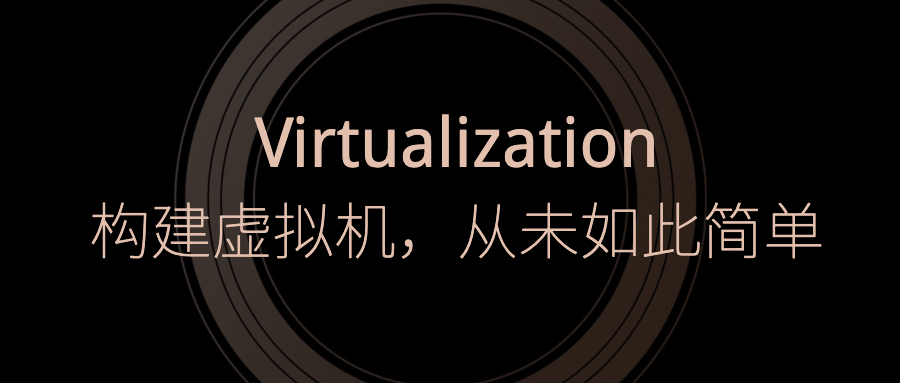
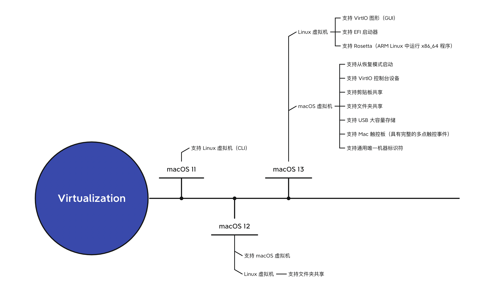

# Session 10002 - 利用 Virtualization 构建虚拟机，从未如此简单

本文基于 [Session 1002](https://developer.apple.com/videos/play/wwdc2022/10002/) 梳理。

> 作者：Mellow，就职于腾讯，iOS/macOS 开发者。给 macOS QQ 适配过 Apple Silicon，给 iOS QQ 适配过 MacCatalyst。
>
> 审核：



> 导读：
>
> - 本文分为：场景、方案、实践、总结四个部分，WWDC Session 的部分主要在《实践》章节
> - 如果对虚拟机的发展和技术方案了解，可以跳过《方案》，直接上手《实践》
> - 《实践》中的 macOS 虚拟机和 Linux 虚拟机内容是独立的，可以选择感兴趣的章节阅读。
> - 《实践》中除了苹果官方的 Demo 可以安装虚拟机，还有开源项目（VirtualApple、MacVM、vftool）可供选择。

## What's New in Virtualization



## 一、场景

- 对于 Mac 开发者，可以更方便的测试 App 在多个不同版本的 macOS 上的兼容性

  > 如果你的 Mac 应用却要兼容较早的 macOS 版本。（比如 macOS 10.11），而没有对应版本的测试机。

- 对于逆向和安全人员，往往需要禁用系统完整性保护 SIP 才能调试第三方应用，在 Guest 中进行此类调试会更加安全

  > 关闭 SIP 会导致部分系统功能不可用，比如 Apple Silicon 上关闭 SIP 会导致无法打开 iOS App。所以为了不影响 Host 机的功能和稳定性，这种调试推荐在虚拟机中进行。

- 搭建持续集成环境，比如 Xcode Server

- 运行网银软件，需要安全封闭的环境（或者与之兼容的系统）

- 运行安全性存疑、或者来源不明软件；测试病毒软件等

- 体验最新（或更早的）的操作系统

## 二、方案

> 在计算机技术中，虚拟化技术（Virtualization）是一种资源管理技术，是将计算机的各种实体资源（CPU、内存、磁盘空间、网路适配器等），予以抽象、转换后呈现出来并可供分割、组合为一个或多个电脑组态环境。

在本文中谈到的虚拟化指**平台虚拟化技术**（Platform Virtualization），是一种针对计算机和操作系统的虚拟化技术。

平台虚拟化是通过名为 Hypervisor 的控制程序 (VMM: Virtual Machine Monitor) 将计算平台的实际物理特性隐藏，为用户提供抽象的、统一的、模拟的计算环境，称为虚拟机 (VM: Virtual Machine)。

虚拟机中运行的操作系统被称为客户机操作系统（Guest OS），运行虚拟机监控器的操作系统被称为主机操作系统（Host OS）

> 实际也存在可以脱离操作系统直接运行在硬件之上的 VMM（如 VMware ESX ）。

### 虚拟机监控器 VMM

VMM（Virtual Machine Monitor ），也叫 Hypervisor。用于控制硬件并向 Guest OS 提供虚拟化的硬件。

> VMM 和 Hypervisor 概念上是完全一致的，都表示虚拟机监控器。本文中统一使用 VMM 。
>
> 另外苹果将自己的底层虚拟化框架命名为 Hypervisor.framework，所以本文在提及 Hypervisor 时，一般是指这个框架。

1974 年，一篇名为《可虚拟化第三代（计算机）架构的规范化条件（ACM, 1974）》论文中提出了满足虚拟化准则所需的三个的充分条件：

1. **资源控制（Resource Control）**：VMM 完全控制所有系统资源。
2. **一致性（Equivalence）**：程序在 VM 中执行与在真实机器上执行结果相同
3. **效率性（Efficiency）**：大部分 VM 指令直接在硬件上执行（无需 VMM 参与）

### x86 虚拟化

#### CPU 保护环

> 又称环型保护、分级保护域。它是操作系统提供的对硬件资源访问级别。Rings 是由两个或更多的特权态组成。在一些硬件或者微代码级别上提供不同特权态模式的 CPU 架构上，保护环通常都是硬件强制的。
>
> ARM CPU 也有类似的概念，但不用 Ring 来表示。


Rings 是从最高特权级（通常被叫作 0 级）到最低特权级（通常对应最大的数字）排列的。

- Ring -1 用于虚拟化

  > 最初是只有 Ring 0 到 Ring 3 的，为了支持硬件辅助的虚拟化，加入了 Ring -1，权限比 Ring 0 更高。
  >
  > Intel 和 AMD 的 CPU 都提供了能使 VMM 存取 Ring 0 硬件的 x86 虚拟化指令集。x86 虚拟化创建了一个叫 Ring -1 的 Ring，所以虚拟机操作系统可以直接运行在 Ring 0 上而不影响其他虚拟机或者宿主系统。

- Ring 0 用于内核代码和驱动程序（对应内核模式，可以和 CPU、内存直接交互）

- Ring 2 用于某些需要特权的代码（例如需要 I/O 权限的用户程序）

- Ring 3 用于非特权代码（对应用户模式，几乎所有的用户程序都在这一级别）

并非所有操作系统都使用了 4 个 Rings，比如 Windows 7 和之前版本的 Windows 只用了 2 个 Rings

#### x86 虚拟化方案

| 虚拟化方案             | 代表 VMM                                                     | 特点                                                         | 优点和缺点                                           |
| ---------------------- | ------------------------------------------------------------ | ------------------------------------------------------------ | ---------------------------------------------------- |
| 半虚拟化               | Xen、Hyper-V、KVM 的 VirtIO                                  | 也叫：超虚拟化、准虚拟化、操作系统辅助虚拟化。需要修改操作系统内核（比如 Windows 内核不开源、Xen 就无法支持）。Guest OS 会意识到它们运行在虚拟环境里。 | 优点：运行速度接近原生。缺点：兼容性差               |
| 全虚拟化（无硬件辅助） | Microsoft Virtual PC、VMware Workstation、Sun Virtual Box、Parallels Desktop for Mac、 QEMU | 不需要修改操作系统内核 VMM 提供底层物理设备的全部抽象化（处理器、内存、时钟、外设）。Guest OS 意识不到虚拟环境的存在。VMM 运行在 Ring 0，Guest OS 运行在 Ring 1 。机制：异常、捕获、翻译 | 优点：兼容性好、支持虚拟化的 OS 多。缺点：运行速度慢 |
| 硬件辅助的全虚拟化     | KVM、Xen 3.0、VMware ESXi、Microsoft Hyper-V                 | x86 上的硬件辅助虚拟化技术：Intel-VT 和 AMD-V（处理器厂商提供支持）。通过创建一个新的 Ring -1 单独给 VMM 使用。 | 性能较好、兼容性较好、比较均衡                       |

一个优秀的虚拟化解决方案往往融合了多项技术：

- Xen 是半虚拟化的 VMM、后来也支持了全虚拟化。
- KVM 是基于硬件辅助的全虚拟化 VMM，但也融合了无硬件辅助的全虚拟化 QEMU 提高兼容性，半虚拟化的 VirtIO 提高性能。

### ARM 虚拟化（Apple Silicon）

#### Hypervisor.framework

Hypervisor 提供 C API，通过这个框架可以在用户空间与虚拟化技术进行交互，而无需编写内核扩展 (KEXT)。

使用此框架从授权的**沙盒用户空间进程**创建和控制硬件支持的虚拟机和虚拟处理器（VM 和 vCPU）。

> 使用 Hypervisor.framework 创建的应用程序可以上架 Mac App Store 。

Hypervisor 框架具有以下要求：

- 要求硬件支持虚拟化

  Hypervisor.framework 只能在具备虚拟化能力的硬件（CPU）上使用

  - 在 Apple 芯片的 Mac 上，包括虚拟化扩展。

  - 在 Intel 芯片的 Mac 上，Hypervisor.framework 支持具有 Intel VT-x 功能集的计算机，包括扩展页表 (EPT) 和无限制模式（Unrestricted Mode）。

  可以在终端运行 `sysctl kern.hv_support`  查看 Hypervisor API 在当前机器上是否可用

  ```shell
  $: sysctl kern.hv_support
  kern.hv_support: 1
  ```

- Entitlements

  | entitlement                   | 作用                                                         | 类型   |
  | ----------------------------- | ------------------------------------------------------------ | ------ |
  | com.apple.security.hypervisor | 指示应用程序是否创建和管理虚拟机。                           | 布尔值 |
  | com.apple.vm.networking       | 指示应用程序是否管理虚拟网络接口而不将权限提升给 root 用户。 | 布尔值 |
  | com.apple.vm.device-access    | 指示应用程序是否捕获 USB 设备并在 Guest OS 中使用它们。      | 布尔值 |

##### 虚拟资源映射

Guest OS 中的虚拟硬件会映射到 Host OS 上：

- 将虚拟处理器抽象为线程

- 将虚拟机抽象为进程：每个虚拟机对应 Host OS 上的一个进程。每个进程一次只能有一个虚拟机

  > 虚拟机中的虚拟 CPU (vCPU) 映射到 POSIX 线程。使用`hv_vcpu_create(_:_:_:)`为当前线程创建一个新的 vCPU 。vCPU 在线程调用  `hv_vcpu_run(_:)` 时运行。

  > POSIX 线程：就是 pthread 开头的那套线程库

- 将虚拟机中的物理内存映射到 Host OS 进程的虚拟内存

  > 使用 `hv_vm_map(_:_:_:_:)`  创建一个新的内存映射。访问映射范围之外的内存会导致 `hv_vcpu_run(_:)` 退出。通过模拟退出时的内存访问并使用 `hv_vcpu_run(_:)` 重新进入 Guest 来模拟内存映射硬件

##### Hypervisor 生命周期

  下图说明了使用 Hypervisor API 创建和运行具有一个或多个虚拟 CPU 的虚拟机的简化生命周期。


在任务开始时：

- 使用 `hv_vm_create(_:)` 创建一个虚拟机
- 使用 `hv_vm_map(_:_:_:_:)` 将当前任务的虚拟地址空间中的一个区域映射到 VM 的来宾（Guest）物理地址空间中
- 使用 `pthread_create(_:_:_:_:)` 创建一个或多个 POSIX 线程。

在每个线程中：

- 使用 `hv_vcpu_create(_:_:_:)` 创建一个虚拟 CPU 。
- 调用 `hv_vcpu_run(_:)` 以运行 vCPU。

当线程接收到退出事件时：

- 处理事件。
- 使用 `hv_vcpu_run(_:)` 重新进入来宾（Guest）或使用 `hv_vcpu_destroy(_:)` 销毁 vCPU 。

在所有线程完成后：

> 默认情况下，创建的 `pthread` 线程即是可连接的（joinable）。所以可以使用 `pthread_join()` 函数在任何其它线程中（以阻塞的方式）等待可连接线程的结束（这里要等待的应该是  `vCPU 0`  ）。

- 使用 `hv_vm_unmap(_:_:)` 取消映射内存区域。
- 使用 `hv_vm_destroy()` 销毁虚拟机。

#### Virtualization.framework

Virtualization.framework 为在 Apple Silicon 和 Intel 的 Mac 上创建和管理虚拟机提供了高级 API。使用这个框架在您定义的自定义环境中引导和运行基于 macOS 或 Linux 操作系统。

> Virtualization.framework  的 API 使用在实践中进行介绍

Virtualization.framework 支持 `Virtual I/O Device (VIRTIO)` 规范，该规范为许多设备类型定义了标准接口，包括：

> Virtual I/O Device (VIRTIO)：<https://docs.oasis-open.org/virtio/virtio/v1.1/csprd01/virtio-v1.1-csprd01.html>)

- 网络（network）

- 套接字（socket）

- 串口（serial port）

- 存储（storage）

- 熵（entropy）

  > 熵是描述一个系统的无序程度。这里可以理解为进行虚拟机数据加密和安全所需要生成的随机数。
  >
  > 在虚拟机中获取熵值往往很耗时，通过虚拟熵设备，虚拟机可以直接从主机获取熵值（随机数）来使用。

- 内存气球（memory-balloon）

  > 一种动态调整 Guest 内存的机制。
  >
  > VZVirtioTraditionalMemoryBalloonDevice 对象实现了一个符合 virtio 的气球内存设备，通过设置 targetVirtualMachineMemorySize 可以调整分配给 Guest 的物理内存。
  >
  > 如果新值小于当前分配的内存量，Guest 会通过 memory-ballon 设备返回未使用内存。返回成功后，VMM 将这些内存从 Guest 释放（回收到 Host）。如果没返回任何内存，就意味着 Guest 占用的内存不变。
  >
  > 如果新值大于当前分配的内存量，VMM 将给 Guest 分配更多的可用内存。
  >
  > 为了获得最佳性能， Guest 应该在通过 memory-ballon 设备返回内存前， 先压缩内存来以减少内存碎片，这样在 memory-ballon 中返回的就是地址连续的空闲内存。

### 总结


本章节介绍了什么是虚拟机，当我们在谈论虚拟机时，实际在谈论的是虚拟机监控器 VMM。通过 x86 平台上虚拟化的方案，可以看到虚拟化技术从半虚拟化**向基于硬件辅助的全虚拟化方向演进**（比如：KVM 替代了 Xen），在这个过程中虚拟机的兼容性、性能都得到了长足的进步，并且两者之间取得了均衡。最后介绍了 Apple Silicon 平台的虚拟化技术，基于现有信息，可知：

- Apple Silicon （M1、M2）作为 CPU 提供了虚拟化能力（ARMv7 开始支持虚拟化）

- Hypervisor.framework 是基于硬件辅助的全虚拟化方案

  > 苹果文档中提到这个框架只能在具备虚拟化能力的硬件（CPU）上使用，当然现在主流的 CPU 都是支持虚拟化的。
  >
  > The Hypervisor framework requires hardware support to virtualize hardware resources.
  >
  > <https://developer.apple.com/documentation/hypervisor>

- Virtualization.framework 在 Hypervisor.framework 提供了高度抽象的封装，并且通过支持半虚拟化 VirtIO 规范，提高了虚拟机性能。

接下来，我们一起在 macOS 上创建可用的 macOS 虚拟机和 Linux 虚拟机。

## 三、实践

注意：

1. 必须下载 ipws 格式的镜像才能创建虚拟机。（不支持通过 Install macOS 13.app 创建）
2. 在 Apple M1 芯片的 Mac 上安装 macOS 12 虚拟机，Host 机器的系统必须是 macOS Monterey 12 或更新版本。
3. macOS ARM 虚拟机的硬盘大小只能在创建时设置一次。目前没有办法在之后更改它。

> Apple M1 芯片的电脑可以在 DFU 模式下，通过 [Apple Configurator](https://support.apple.com/en-ca/apple-configurator) 来加载 ipsw 文件恢复操作系统，就像恢复 iOS 设备一样。
>
> 你可以通过这个网站 <https://ipsw.me/product/Mac> 轻松下载到适合自己设备的 ipsw 文件

### macOS 虚拟机

#### 下载镜像

在一切开始前，先下载好要安装的系统镜像，因为这是整个体验 macOS 虚拟机过程中最耗时的一步。

苹果在示例中是先通过 `VZMacOSRestoreImage.fetchLatestSupported` 获取下载链接，然后再把镜像下载下来。

```swift
VZMacOSRestoreImage.fetchLatestSupported { [self](result: Result<VZMacOSRestoreImage, Error>) in
    switch result {
        case let .failure(error):
            fatalError(error.localizedDescription)

        case let .success(restoreImage):
            downloadRestoreImage(restoreImage: restoreImage, completionHandler: completionHandler)
    }
}
```

通过这个接口，可以安全、便捷的检索到最新的 ipsw 镜像。建议开发者可以在第一次启动虚拟机时显示可供下载的镜像。

macOS 上的商业虚拟机产品  Parallels Desktop 17 使用了 Virtualization 框架，它正是这么做的。


但鉴于第一次体验，我的建议是，手动通过下载器下载镜像：UniversalMac_12.4_21F79_Restore.ipsw（如果你要体验 macOS 13，需要下载对应的 ipsw）

> <https://updates.cdn-apple.com/2022SpringFCS/fullrestores/012-06874/9CECE956-D945-45E2-93E9-4FFDC81BB49A/UniversalMac_12.4_21F79_Restore.ipsw>

#### 配置 entitlement 文件

- 如果是新建的工程，需要在 `Signing & Capabilities->App Sandbox`  添加沙盒能力来创建 `entitlement` 文件


- 在 entitlement 文件中添加键值对。Key 是`com.apple.security.virtualization`，Value 是`YES`.


#### 配置 CPU、内存、存储

创建一个虚拟机，就像你在选购 Mac 时看到的这些参数一样，基础参数有：CPU 核数、内存大小、存储空间大小。

> CPU 和内存每次启动时都可以修改。存储空间大小目前不支持动态调整，需要在第一次创建时一步到位。


```swift
let config = VZVirtualMachineConfiguration()
config.cpuCount = 4
config.memorySize = (4 * 1024 * 1024 * 1024) as UInt64
config.storageDevices = [createBlockDeviceConfiguration()]
config.pointingDevices = [createPointingDeviceConfiguration()]

static func createBlockDeviceConfiguration() -> VZVirtioBlockDeviceConfiguration {
    guard let diskImageAttachment = try? VZDiskImageStorageDeviceAttachment(url: URL(fileURLWithPath: diskImagePath), readOnly: false) else {
        fatalError("Failed to create Disk image.")
    }
    let disk = VZVirtioBlockDeviceConfiguration(attachment: diskImageAttachment)
    return disk
}

static func createPointingDeviceConfiguration() -> VZUSBScreenCoordinatePointingDeviceConfiguration {
    return VZUSBScreenCoordinatePointingDeviceConfiguration()
}

```

#### 配置 Mac 平台

> 设置硬件型号 hardwareModel、辅助存储 auxiliaryStorage、设备标识符 machineIdentifier）

```swift
private func createMacPlaform() -> VZMacPlatformConfiguration {
    let macPlatform = VZMacPlatformConfiguration()

    let auxiliaryStorage = VZMacAuxiliaryStorage(contentsOf: auxiliaryStorageURL)
    macPlatform.auxiliaryStorage = auxiliaryStorage

    if !FileManager.default.fileExists(atPath: vmBundlePath) {
        fatalError("Missing Virtual Machine Bundle at \(vmBundlePath). Run InstallationTool first to create it.")
    }

    // 获取设备型号（需要在安装虚拟机时持久化保存）
    guard let hardwareModelData = try? Data(contentsOf: hardwareModelURL) else {
        fatalError("Failed to retrieve hardware model data.")
    }

    guard let hardwareModel = VZMacHardwareModel(dataRepresentation: hardwareModelData) else {
        fatalError("Failed to create hardware model.")
    }

   // 判断虚拟机的设备型号是否被当前 Host OS 支持
    if !hardwareModel.isSupported {
        fatalError("The hardware model isn't supported on the current host")
    }
    macPlatform.hardwareModel = hardwareModel

   // 获取设备唯一标识符（需要在安装虚拟机时持久化保存）
    guard let machineIdentifierData = try? Data(contentsOf: machineIdentifierURL) else {
        fatalError("Failed to retrieve machine identifier data.")
    }

    guard let machineIdentifier = VZMacMachineIdentifier(dataRepresentation: machineIdentifierData) else {
        fatalError("Failed to create machine identifier.")
    }
    macPlatform.machineIdentifier = machineIdentifier

    return macPlatform
}

config.platform = createMacPlaform()
```

#### 配置 Boot Loader

```
config.bootLoader = VZMacOSBootLoader()
```

#### 配置网络

```swift
static func createNetworkDeviceConfiguration() -> VZVirtioNetworkDeviceConfiguration {
    let networkDevice = VZVirtioNetworkDeviceConfiguration()

    let networkAttachment = VZNATNetworkDeviceAttachment()
    networkDevice.attachment = networkAttachment
    return networkDevice
}

config.networkDevices = [createNetworkDeviceConfiguration()]
```

#### 配置图形设备（显示器）

> 在 macOS 虚拟机中可以使用 Metal 渲染得到出色的图形性能

```swift
static func createGraphicsDeviceConfiguration() -> VZMacGraphicsDeviceConfiguration {
    let graphicsConfiguration = VZMacGraphicsDeviceConfiguration()
    graphicsConfiguration.displays = [
        // We abitrarily choose the resolution of the display to be 1920 x 1200.
        VZMacGraphicsDisplayConfiguration(widthInPixels: 1920, heightInPixels: 1200, pixelsPerInch: 80)
    ]

    return graphicsConfiguration
}

config.graphicsDevices = [createGraphicsDeviceConfiguration()]
```

#### 配置键盘

```
config.keyboards = [VZUSBKeyboardConfiguration()]
```

#### 配置触控板和鼠标

> 触控板仅在 macOS 13 支持，在虚拟机中支持完整的手势，比如：旋转、缩小放大

```swift
if #available(macOS 13, *) {
  // 触控板
 config.pointingDevices = [VZMacTrackpadConfiguration()]
} 
// 鼠标
config.pointingDevices = [VZUSBScreenCoordinatePointingDeviceConfiguration()]
```

#### 配置音频输入和输出

```swift
static func createAudioDeviceConfiguration() -> VZVirtioSoundDeviceConfiguration {
    let audioConfiguration = VZVirtioSoundDeviceConfiguration()

    let inputStream = VZVirtioSoundDeviceInputStreamConfiguration()
    inputStream.source = VZHostAudioInputStreamSource()

    let outputStream = VZVirtioSoundDeviceOutputStreamConfiguration()
    outputStream.sink = VZHostAudioOutputStreamSink()

    audioConfiguration.streams = [inputStream, outputStream]
    return audioConfiguration
}

config.audioDevices = [MacOSVirtualMachineConfigurationHelper.createAudioDeviceConfiguration()]
```

#### 配置文件共享

> 在 macOS 12，苹果已经通过 Virtio file-system 实现了对 Linux 虚拟机的共享文件，但是尚不支持 macOS 虚拟机。
>
> 在 macOS 13，苹果添加了对 macOS 虚拟机的共享文件支持，对共享文件夹的任何修改都会同时反映在 Host OS 和 Guest OS 中

```swift
let sharedDirectory = VZSharedDirectory(url: directoryURL, readOnly: false)

// 这里以单个文件夹为例，使用 VZMultipleDirectoryShare 可以共享多个文件夹
let share = VZSingleDirectoryShare(directory: sharedDirectory)

// 创建一个自动挂载的 Tag，以此 Tag 创建一个共享文件系统的设备
let tag = VZVirtioFileSystemDeviceConfiguration.macOSGuestAutomountTag
let sharingDevice = VZVirtioFileSystemDeviceConfiguration(tag: tag)
sharingDevice.share = share

config.directorySharingDevices = [sharingDevice]
```

#### 配置验证

最后，对所有设置项进行验证。然后通过设置项启动一个虚拟机

```swift
try! config.validate()

virtualMachine = VZVirtualMachine(configuration: config)
```

以上设置项可以设计一个 GUI 界面（截图自开源项目 VirtualApple），方便用户设定符合自己需求的虚拟机。

#### 安装虚拟机

- 安装 ipsw 镜像到前面设置好的 macOS 虚拟机中（`VZVirtualMachine`）

```swift
public func installMacOS(ipswURL: URL) {
    NSLog("Attempting to install from IPSW at \(ipswURL).")
    VZMacOSRestoreImage.load(from: ipswURL, completionHandler: { [self](result: Result<VZMacOSRestoreImage, Error>) in
        switch result {
            case let .failure(error):
                fatalError(error.localizedDescription)

            case let .success(restoreImage):
                installMacOS(restoreImage: restoreImage)
        }
    })
}

private func installMacOS(restoreImage: VZMacOSRestoreImage) {
    guard let macOSConfiguration = restoreImage.mostFeaturefulSupportedConfiguration else {
        fatalError("No supported configuration available.")
    }

    if !macOSConfiguration.hardwareModel.isSupported {
        fatalError("macOSConfiguration configuration isn't supported on the current host.")
    }

    DispatchQueue.main.async { [self] in
        startInstallation(restoreImageURL: restoreImage.url)
    }
}

private func startInstallation(restoreImageURL: URL) {
    // 安装到前面步骤配置的虚拟机 virtualMachine 里
    let installer = VZMacOSInstaller(virtualMachine: virtualMachine, restoringFromImageAt: restoreImageURL)

    NSLog("Starting installation.")
    installer.install(completionHandler: { (result: Result<Void, Error>) in
        if case let .failure(error) = result {
            fatalError(error.localizedDescription)
        } else {
            NSLog("Installation succeeded.")
        }
    })

    // 观察安装进度百分比
    installationObserver = installer.progress.observe(\.fractionCompleted, options: [.initial, .new]) { (progress, change) in
        NSLog("Installation progress: \(change.newValue! * 100).")
    }
}
```

大约 3 分 30 秒就可以安装完成一个 macOS 虚拟机

```shell
2022-06-17 12:06:11.189538+0800 InstallationTool-Swift[36664:10706168] Attempting to install from IPSW at file:///Users/mellow/Downloads/UniversalMac_12.4_21F79_Restore.ipsw.
2022-06-17 12:06:11.295040+0800 InstallationTool-Swift[36664:10706663] Starting installation.
2022-06-17 12:09:40.809988+0800 InstallationTool-Swift[36664:10711292] Installation progress: 100.0.
2022-06-17 12:09:40.810159+0800 InstallationTool-Swift[36664:10711292] Installation succeeded.
2022-06-17 12:10:06.298998+0800 InstallationTool-Swift[36664:10711292] Guest did stop virtual machine.
Program ended with exit code: 0
```

#### 启动虚拟机

创建好了虚拟机实例后，如何在界面上显示出来，这一步非常简单

- 创建一个 `VZVirtualMachineView()`  作为显示容器
- 将虚拟机设置给视图容器：`virtualMachineView.virtualMachine = virtualMachine`

```swift
virtualMachine.delegate = self
virtualMachineView.virtualMachine = virtualMachine
virtualMachine.start(completionHandler: { (result) in
    switch result {
        case let .failure(error):
            fatalError("Virtual machine failed to start \(error)")

        default:
            NSLog("Virtual machine successfully started.")
    }
})

// 代理方法：虚拟机异常退出
func virtualMachine(_ virtualMachine: VZVirtualMachine, didStopWithError error: Error) {
    NSLog("Virtual machine did stop with error: \(error.localizedDescription)")
}

/// 代理方法：虚拟机正常退出
func guestDidStop(_ virtualMachine: VZVirtualMachine) {
    NSLog("Guest did stop virtual machine.")
}
```

启动虚拟机，就可以见证奇迹时刻，看到系统启动画面


虚拟机在名称、型号标识符、芯片上都有自己的命名方式。


#### 启动到恢复模式

> 仅 macOS 13 支持

```swift
let options = VZMacOSVirtualMachineStartOptions()
// 通过设置 startUpFromMacOSRecovery 可以引导到恢复模式
options.startUpFromMacOSRecovery = true
virtualMachine.start(options: options)
```

#### 基于 Virtualization 的开源项目

如果你在苹果示例 Demo 安装虚拟机过程中遇到问题，不妨试试以下两个开源项目。

- VirtualApple（<https://github.com/saagarjha/VirtualApple>）。通过私有 API，它允许配置 VM 以引导到 DFU 或 Recovery 模式 （系统完整性保护 SIP 必须在恢复模式下修改），还支持引导到启动的早期阶段并附加调试器。


- MacVM（ <https://github.com/KhaosT/MacVM.git>）

编译好项目后，选择前面下载好的  restore.ipsw 镜像，就可以创建一个 macOS 虚拟机来体验。

整个流程甚至比苹果官方的 Demo 还要简单，这两个项目都支持在 macOS 12 上编译。

#### 体验 macOS 虚拟机

- 安装速度非常快（只需要 3 分 30 秒，物理机上的 macOS 更新一次需要半小时）
- 鼠标和键盘偶尔会失去焦点，需要先点击其他窗口后，再激活虚拟机窗口才能恢复。
- 启动速度比物理机上的 Host OS 更快（从看到 Apple 白色 Logo 开始计时到密码输入框只需要 3 秒）

如果你安装的是 macOS 12 虚拟机，那么以下功能不可用（部分功能在 macOS 13 得到支持）：

- **暂停和恢复：** 尚不支持。

- **配置：** 可以修改虚拟 CPU 核数和内存大小，无法更改虚拟 UUID、MAC 地址等内容。

- **快照：** 不支持。

- **共享剪贴板**：不支持

- **共享文件夹：** 不支持（也不支持拖放）。

  > 可以使用 [macOS 文件共享功能](https://support.apple.com/guide/mac-help/set-up-file-sharing-on-mac-mh17131/mac) 在虚拟机和 Mac 之间共享文件。

- **虚拟 Wi-Fi 适配器：**不支持（通过虚拟以太网连接主系统网络）

- **USB 设备：** 无法识别 USB 设备。

- **磁盘大小：** 不支持动态修改磁盘大小（只能在安装虚拟机时设置一次）

- **启动选项/恢复模式：** 无法访问 macOS 启动选项（例如恢复模式、安全模式等）

- **Apple ID：** 无法登陆 Apple ID（意味着无法通过 App Store 下载程序）

  

- **网络摄像头**：不支持（内置的也不支持）

如果你安装的是 macOS 13  Ventura 虚拟机，相比 12 增加的支持有：

- 支持从恢复模式启动

- 支持 VirtIO 控制台设备
- 支持剪贴板共享
- 支持 USB 大容量存储
- 支持 Mac 触控板（具有完整的多点触控事件）

- 支持通用唯一机器标识符

#### CinebenchR23 跑分

我们通过跑分可以获取一些客观数据，在 Host OS 和 Guest OS 中安装 CinebenchR23 ，分别进行一轮跑分：

> 芯片： Apple M1 Pro
>
> 核数：   10（8 性能和 2 能效）
>
> 内存： 32 GB

| 对比 | 宿主机（Host OS） | 虚拟机（Guest OS） |
| ---- | ----------------- | ------------------ |
| CPU  | 10 核 10 线程        | 5 核 5 线程           |
| 单核 | 1511.880149       | 1467.797438        |
| 多核 | 12272.162781      | 6946.077642        |

跑分报告节选：

```
# 宿主机（Host OS）
CORES=10
THREADS=10
MHZ_ESTIMATE=3018.919278
PROCESSOR=Apple M1 Pro
CBTYPE=64 BIT
OSVERSION=macOS: 版本12.3（版号21E230）
CBCPU1PEAK=1511.880149
CBCPUXPEAK=12272.162781
C4DVERSION=23.200
C4DBUILDID=RBBenchmark330542

# 虚拟机（Guest OS）
CORES=5
THREADS=5
MHZ_ESTIMATE=3036.416989
PROCESSOR=Apple M1 Pro (Virtual)
CBTYPE=64 BIT
OSVERSION=macOS: 版本12.4（版号21F79）
CBCPU1PEAK=1467.797438
CBCPUXPEAK=6946.077642
C4DVERSION=23.200
C4DBUILDID=RBBenchmark330542
```

可以看出：

- 单核性能方面，虚拟机和宿主机单核性能基本一致。

- 多核性能方面，只分配了 50% 核数的虚拟机达到宿主机的 56.6%。

  > 由于虚拟 CPU 和 物理 CPU 没有一一对应关系，实际上虚拟机可能占用更多物理 CPU 资源，这里的多核跑分仅供参考（娱乐）。
  > 这里如果将 CPU 核数和内存大小分配的和宿主机一样，应该能得到一个更准确的多核跑分。

#### Geekbench5 跑分

一位叫 Timothy Sutton 的开发者，早在 2021 年就使用 GeekBench5 对物理机和虚拟机的跑分

> 跑分报告：
>
> M1 Mac mini：<https://browser.geekbench.com/v5/cpu/10276653>
>
> 虚拟机：<https://browser.geekbench.com/v5/cpu/10303746>

| 对比 | 宿主机（Host OS） | 虚拟机（Guest OS） |
| ---- | ----------------- | ------------------ |
| CPU  | 8 核               | 8 核                |
| 内存 | 16GB              | 8GB                |
| 单核 | 1725              | 1733               |
| 多核 | 7613              | 7437               |

在这个 Geekbench5 跑分中，虚拟 CPU 和物理 CPU 的核数一致，物理机和虚拟机的跑分只相差 176（大约损失 2.3%性能）。

这个性能表现看起来非常强悍，或许这也说明了，基于硬件辅助的虚拟化、结合半虚拟化的 VirtIO 驱动可以达到接近原生的性能。

> 作为参照：Xen 作为半虚拟化技术，通常损失 2% 性能，最坏情况损失 8% 性能。

| **项目**          | **虚拟机（多核）**      | **物理机（多核）**      |
| ----------------- | ----------------------- | ----------------------- |
| AES-XTS           | 9928 16.9 GB/sec        | 10138 17.3 GB/sec       |
| Text Compression  | 5761 29.1 MB/sec        | 5892 29.8 MB/sec        |
| Image Compression | 6988 330.6 Mpixels/sec  | 7164 338.9 Mpixels/sec  |
| HTML5             | 7846 9.21 MElements/sec | 7871 9.24 MElements/sec |
| SQLite            | 6965 2.18 Mrows/sec     | 7207 2.26 Mrows/sec     |
| PDF Rendering     | 6425 348.7 Mpixels/sec  | 7127 386.8 Mpixels/sec  |
| Text Rendering    | 7589 2.36 MB/sec        | 7633 2.37 MB/sec        |
| Clang             | 8636 67.3 Klines/sec    | 8641 67.3 Klines/sec    |

其他游戏和渲染相关的 N-Body Physics、Rigid Body Physics、Gaussian Blur、Ray Tracing 及语音识别、机器学习等跑分可以点击链接查看详情，自行对比差异（非常小）。

### Linux 虚拟机（GUI）

下载镜像：<https://cdimage.ubuntu.com/focal/daily-live/current/focal-desktop-arm64.iso>

- Apple Silicon 机型下载 arm64 或者 AArch64 的 iso 镜像
- Intel 机型下载 x86_64 或者 amd64 的 iso 镜像

#### macOS 13 新增支持

支持 Linux VM 的更多功能：EFI BootLoader、VirtIO 图形、Rosetta 支持

#### 安装 Linux

安装 Linux 到物理机的过程差不多是这样：先下载  `ISO` 文件，然后使用烧录工具烧录到 U 盘上，最后重启电脑时，设置 U 盘作为启动盘，进入安装程序。

安装 Linux 虚拟机实际上更简单，我们使用虚拟的 USB 驱动直接加载 ISO 文件，还省去了烧录到 U 盘的过程。

> 在使用体验上，相当于你选中一个 ISO 文件，就可以进入安装界面。

```swift
let diskImageURL = URL(fileURLWithPath: "linux.iso")
// 通过 iso 创建一个磁盘镜像存储设备作为附件
let attachment = try! VZDiskImageStorageDeviceAttachment(url: diskImageURL, readOnly: true)

// 使用 USB 大容量存储设备启动来加载创建的磁盘附件
let usbDeviceConfiguration = VZUSBMassStorageDeviceConfiguration(attachment: attachment)
configuration.storageDevices = [usbDeviceConfiguration, createBlockDevice()]
```

#### 启动 Linux

在 `macOS 13 Ventura`， Apple 增加了对 `EFI` 的支持

> EFI 是一套启动 Intel 或者 Arm 硬件设备的行业标准。
>
> EFI 的作用是自动发现可以启动的 installer 或者 USB 驱动，当你在 EFI 启动器界面上选择了启动器后，就可以从这个启动器启动（安装新系统、进入操作系统）。

EFI 需要非易失性内存（NVRAM）来查找启动器的信息，但是我们是虚拟机，需要把这个数据存储在本地文件系统里。

> 在苹果的示例中是保存在 ~/GUI Linux VM.bundle/NVRAM

```swift
let bootloader = VZEFIBootLoader()
if needInstall {
  // 安装时，创建一个 NVRAM 文件来保存启动器信息
  bootloader.variableStore = VZEFIVariableStore(creatingVariableStoreAt: URL(fileURLWithPath:efiVariableStorePath))
} else {
  // 使用时，读取 NVRAM 文件里的启动器信息
  bootloader.variableStore = VZEFIVariableStore(url: URL(fileURLWithPath: efiVariableStorePath))
}
configuration.bootLoader = bootloader
```

#### 配置 Linux 图形设备（显示器）

在 `macOS 13 Ventura`， Apple 增加了对 `Virtio GPU 2D` 的支持，可以显示 Linux GUI 界面了。（macOS 11 和 12 支持 Linux CLI）

> Virtio GPU 2D 是一个半虚拟化设备, 可以在 Host OS 里面显示出 Linux 的界面。Linux 把渲染的帧提供给 Virtualization 框架显示出来。

```swift
let graphicsDevice = VZVirtioGraphicsDeviceConfiguration()
graphicsDevice.scanouts = [
 VZVirtioGraphicsScanoutConfiguration(widthInPixels: 1280, heightInPixels: 720)
]

configuration.graphicsDevices = [graphicsDevice]
```

#### 配置 Rosetta 2

使用 Apple Silicon 的电脑，在 `macOS 13 Ventura` 及更高系统版本上，在安装 Linux 虚拟机时，可以使用 Rosetta 2 在 ARM Linux 虚拟机中运行 x86_64 的二进制程序。

> 基于 Apple Silicon 的计算机，安装虚拟机时应该选择 ARM Linux 发行版，否则 Rosetta 2 无法工作。
>
> 基于 Intel 的 Mac 计算机，安装虚拟机时选择 Intel Linux 发行版，当然这就不需要通过 Rosetta 来转换了

由于 Rosetta 翻译的速度很快, 所以 ARM Linux 执行 x86 程序会有出色的性能表现。

```swift
let rosettaDirectoryShare = try! VZLinuxRosettaDirectoryShare()
let directorySharingDevice = VZVirtioFileSystemDeviceConfiguration(tag: "RosettaShare")
directorySharingDevice.share = rosettaDirectoryShare

configuration.directorySharingDevices = [directorySharingDevice]
```

下面我们将 Rosetta 和 Linux 系统关联起来, 可以使用`update-binfmts`告诉系统使用 Rosetta 来处理任何的 x86_64 文件。

```shell
mount -t virtiofs RosettaShare /mnt/Rosetta

sudo /usr/sbin/update-binfmts --install rosetta /mnt/Rosetta/rosetta \
  --magic "\x7fELF\x02\x01\x01\x00\x00\x00\x00\x00\x00\x00\x00\x00\x02\x00\x3e\x00" \
  --mask "\xff\xff\xff\xff\xff\xfe\xfe\x00\xff\xff\xff\xff\xff\xff\xff\xff\xfe\xff\xff\xff" \
  --credentials yes --preserve no --fix-binary yes
```

#### 安装 Linux 过程

> Ubuntu 的安装过程中需要通过网络下载更新，安装过程会稍久


抹盘安装：


### Linux 虚拟机（CLI）

如果你的系统是 macOS 11 或 macOS 12，暂时无法体验官方 Demo。可以试试这个项目 vftool：<https://github.com/evansm7/vftool> ，是一个基于 Virtualization.framework 的命令行工具，可以轻松创建一个超轻量级 Linux 命令行虚拟机。

> Vftool runs Linux virtual machines with virtio block, network, entropy and console devices

支持配置：

- 内存大小
- CPU 核数（VCPUS）
- 附加光盘镜像、CDROM 镜像（AKA 只读光盘镜像）
- Initrd
- 内核
- 内核命令行

创建的 Linux 虚拟机没有 GUI 界面，仅有（文本）控制台和网络，对配置要求很低。

默认配置是 1 CPU、512MB RAM、“console=hvc0”、基于 NAT 的网络、无磁盘或 initrd、并为控制台创建一个 pty。

> The (current) default is 1 CPU, 512MB RAM, "console=hvc0", NAT-based networking, no discs or initrd and creates a pty for the console.

#### 下载 Linux 镜像

以 Ubuntu 为例，在这里 <https://cloud-images.ubuntu.com/releases/focal/release/unpacked/> 下载 vmlinuz、initrd、disk image 三个文件

- kernel：<https://cloud-images.ubuntu.com/releases/focal/release/unpacked/ubuntu-20.04-server-cloudimg-arm64-vmlinuz-generic>
- initrd：<https://cloud-images.ubuntu.com/releases/focal/release/unpacked/ubuntu-20.04-server-cloudimg-arm64-initrd-generic>
- disk image：<https://cloud-images.ubuntu.com/releases/focal/release/ubuntu-20.04-server-cloudimg-arm64.tar.gz>

> 示例是 Apple Silicon 机型的文件

#### 解压 Linux 镜像

```bash
# 给 vmlinuz 改名并解压
mv vmlinuz vmlinuz.gz
gunzip vmlinuz.gz

# 解压
tar xvfz ubuntu-20.04-server-cloudimg-arm64.tar.gz
```

#### 创建数据盘

```bash
# 50GB
dd if=/dev/zero of=data.img bs=1m count=51200
```

#### 创建 Linux 虚拟机

```
vftool \
  -k vmlinuz \
  -i initrd \
  -c focal-server-cloudimg-arm64.img \
  -d data.img \
  -m 2048 \
  -a "console=hvc0"
```

在启动虚拟机前，还需要配置：挂载硬盘、设置主机名和 ssh 秘钥、设置网络、root 用户和密码登录等。

具体配置过程可以参考这篇文章：<https://cloud.tencent.com/developer/article/1778892>

#### 启动 Linux 虚拟机

```
vftool \
  -k vmlinuz \
  -i initrd \
  -d data.img \
  -m 2048 \
  -a "console=hvc0 root=/dev/vda" \
  -t 0
```

#### 启动界面

启动后，要求输入前面配置好的用户名和密码，然后登陆成功可以看到：

```
Welcome to Ubuntu 20.04.4 LTS (GNU/Linux 5.4.0-120-generic aarch64)

 * Documentation:  https://help.ubuntu.com
 * Management:     https://landscape.canonical.com
 * Support:        https://ubuntu.com/advantage

  System information as of Thu Apr 21 12:55:04 UTC 2022

  System load: 0.17              Memory usage: 8%   Processes:       88
  Usage of /:  95.2% of 1.32GB   Swap usage:   0%   Users logged in: 0

  => / is using 95.2% of 1.32GB


0 updates can be applied immediately.

Failed to connect to https://changelogs.ubuntu.com/meta-release-lts. Check your Internet connection or proxy settings


Last login: Thu Apr 21 12:54:46 UTC 2022 on hvc0
```

通过虚拟化技术，我们在 macOS 创建一个非常轻量级的 Linux CLI 版本。是不是感觉和 Windows WSL（Windows Subsystem for Linux）技术运行的 Linux 子系统很像？实际上 Windows WSL 也是一种虚拟化技术。（<https://docs.microsoft.com/zh-cn/windows/wsl/compare-versions>）

## 四、总结

本文介绍了平台虚拟化技术的方案类型，对比了 Linux 和 Windows 上的虚拟化方案，分析了 macOS 上的虚拟化框架属于：基于硬件辅助的全虚拟化方案，并且通过支持半虚拟化 VirtIO 规范，提高了 macOS 平台上虚拟机性能。

通过  Virtualization.framework 和基于这个框架的命令行工具，我们创建了可用的 macOS 虚拟机、Linux 虚拟机（GUI）、Linux（CLI），并对 macOS 虚拟机进行了体验和简单测评。

Virtualization.framework 简洁的封装使得每个开发者都可以轻易的开发出属于自己的虚拟机产品。虚拟机厂商 Parallels 第一时间使用 Apple Silicon 上新的虚拟化方案开发了新虚拟机： Parallels Desktop 17 。同时也看到 Virtualization.framework 仍然处于早期阶段，现在尚不支持虚拟机的快照、登陆 AppleID、动态调整磁盘大小等功能。相信随着后续 macOS 版本的推出，这些问题会逐步得到解决。

纵观虚拟化技术的发展历史，它的初心始终没有改变：就是为了对计算资源高效管理、充分利用。在虚拟化技术的基础上，长出了云计算的参天大树。在个人计算机领域，虚拟机给多数人固有的印象还是：卡和慢，但实际上现代虚拟机运行速度可以做到物理机几乎没有差异。

现在，大家可以利用 Virtualization.framework 打造自己的专属虚拟机，尽享各平台的丰富的软件生态，实现对个人计算资源的充分利用。
