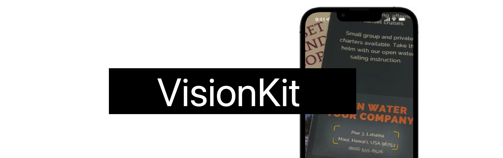

## 个人介绍

Layer（杨杰），就职于抖音 iOS 即时通讯团队，经常被可爱的人看到个人介绍。

## 审核介绍

## 不超过 120 个字的文章简介

本文将与大家一同认识 VisionKit 中的 `DataScannerViewController`。通过简单的 Swift API 来实时的捕获视频源中的文本、条码。将展示如何控制程序捕获的内容，以及如何启用用户指导、突出显示等。

## 公众号/小专栏图文头图

