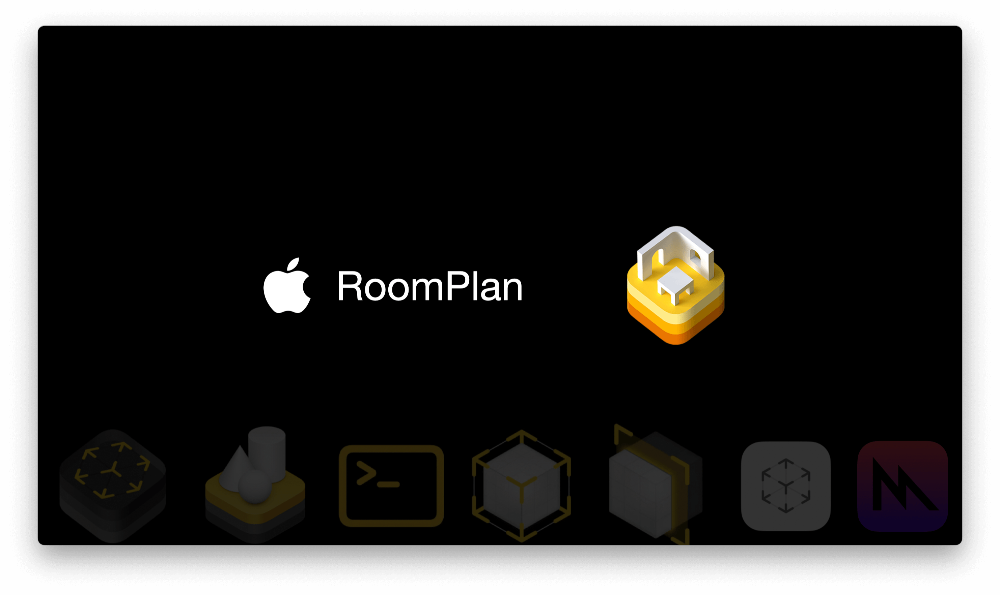

## 个人介绍

彪彪，浙江大学三维视觉方向在读博士生，AR/MR 技术爱好者，曾获得移动应用创新赛 AR 赛道一等奖，WWDC 22 学生挑战赛奖项。

## 审核介绍

苹果 API 搬运工，爱写文章的 ARKit 开发者。专栏[《ARKit 与计算几何》](https://xiaozhuanlan.com/computationalgeometry)，[《Metal Shader 快速使用入门》](https://xiaozhuanlan.com/metalforbeginner)

## 不超过 120 个字的文章简介

本文将主要聚焦于 Apple 的 AR/MR 新 API：RoomPlan 。全文共分为 3 个部分：第一部分是 Apple 的 AR/MR 技术发展回顾，包括 RoomPlan 和 Object Capture 技术背后的原理简介。第二部分是对 RoomPlan 技术的介绍，包括如何使用官方 API ，快速在您的 App 中使用 RoomPlan，以及如何通过数据 API 自定义 RoomPlan 的使用。最后一部分是关于 AR/MR 应用设计实践的相关建议。

## 公众号/小专栏图文头图

