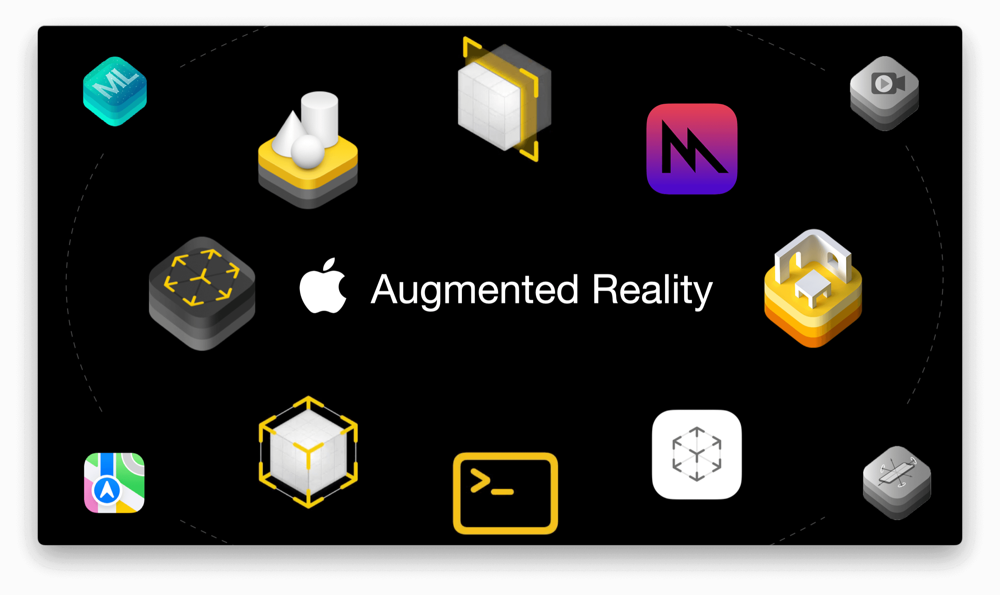
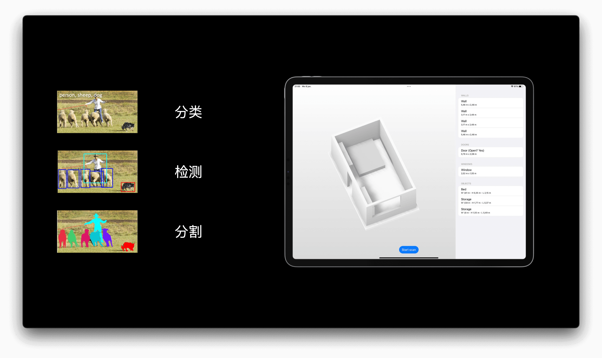
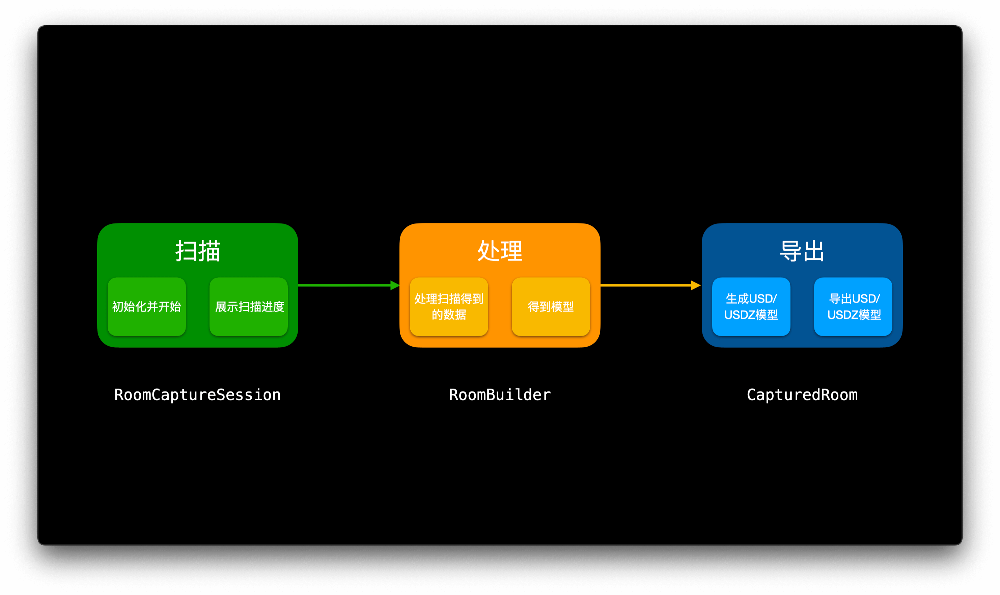
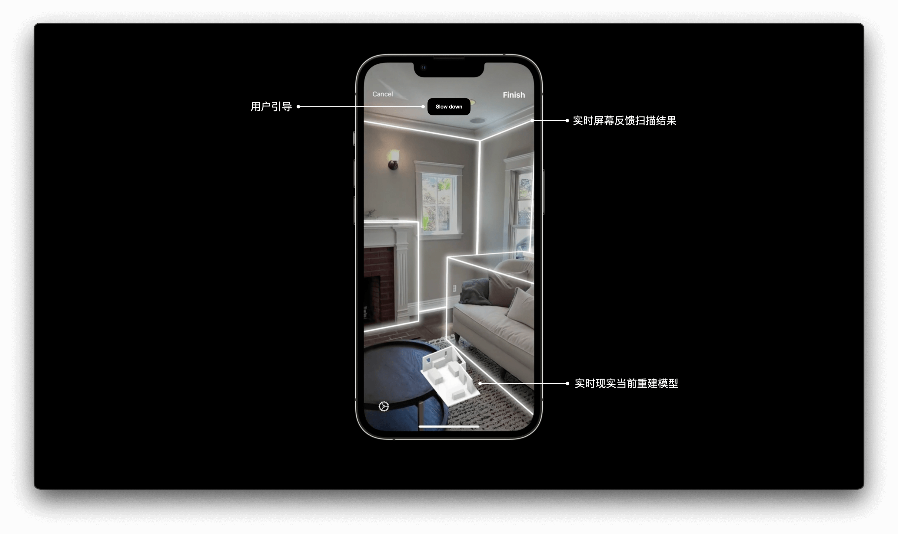
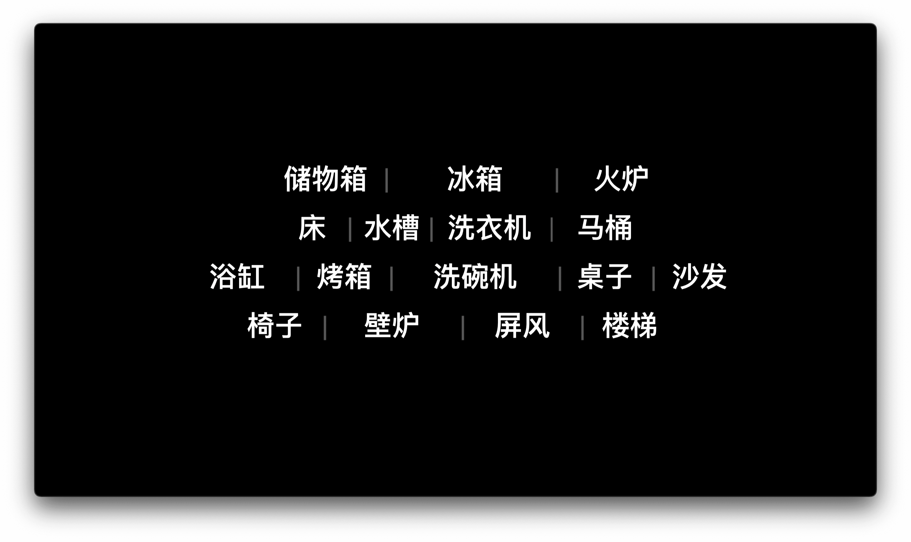
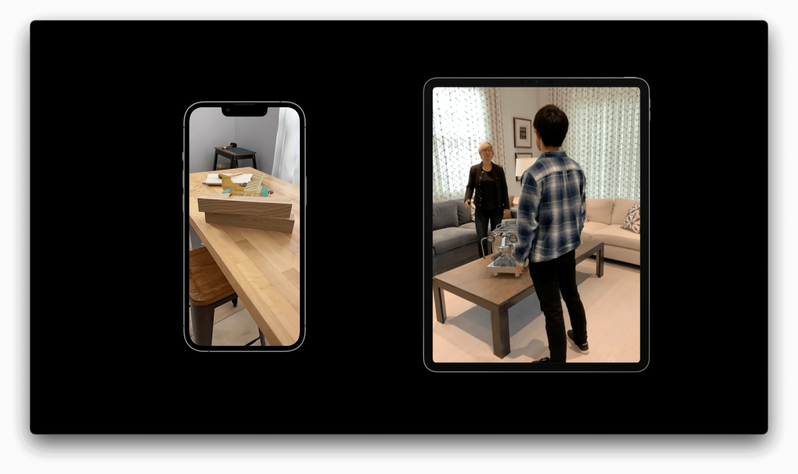

# Session 10127/10131 - 使用 RoomPlan 扫描创建参数化三维室内场景

> 作者：彪彪，WWDC 2022 学生挑战赛获奖者，第六届移动应用创新赛 AR 赛道第一名
>
> 审核：

> **注：因为文章撰写时，RoomPlan 还处于 Beta 软件阶段，我们将根据最终的 API 更新一些内容**

相信今年 WWDC 召开之前，很多朋友的预测就是 RealityOS 将“千呼万唤始出来”，可惜无论是关于增强现实、混合现实（下统一称 AR/MR ）新的操作系统还是新的硬件都没有任何影子，而且更令人感到奇怪的是，2022 年 WWDC 中关于 AR/MR 的相关技术更新特别少，甚至第一天的 Keynote 中都没有任何相关的技术展示，给人一种“此地无银三百两”的感觉。不管怎么说这都是作者的个人猜测，虽说今年 AR/MR 技术没有太多更新，但还是有一个新框架得到了大家热烈讨论、试用、夸赞，也就是今天的主角—— RoomPlan 。

本文将主要聚焦于 Apple 的 AR/MR 新 API：RoomPlan 。全文共分为 3 个部分：

第一部分是 Apple 的 AR/MR 技术发展回顾，以及 RoomPlan 和 Object Capture 技术背后的原理简介。

第二部分是对于 RoomPlan 技术的介绍，包括如何使用官方 API 快速在相关 App 中使用 RoomPlan，以及如何通过数据 API 自定义 RoomPlan 的使用。

最后一部分是关于 AR/MR 应用设计的相关建议。

> 阅读建议
> 如果你是被 RoomPlan 吸引的 AR/MR 新手，建议全文阅读，并配合以往的小专栏文章进行学习；
>
> 如果你只关心最新 RoomPlan 的 API，可以直接跳到文章的第二部分
>
> 如果你想了解使用 RoomPlan 的注意事项以及 AR/MR 应用的设计原则，可以直接跳转到文章的第三部分
>
> 相关 Session ：
>
> [Session 10127 Create parametric 3D room scans with RoomPlan](https://developer.apple.com/videos/play/wwdc2022/10127/)
>
> [Session 10131 Qualities of great AR experiences](https://developer.apple.com/videos/play/wwdc2022/10131)

## Apple 的 AR/MR 技术发展回顾

Apple 关于 AR/MR 的布局最早可以追溯到 2014 年，在那一年 Apple 推出了**Metal Shading Language**，之后 2017 年首次推出 ARKit，2018 年推出了 3D 模型快速预览框架 AR Quick Look，2019 年推出基于 Metal 的渲染引擎 RealityKit，2021 年推出了三维模型建模技术 Object Capture 以及今年推出了参数化室内建模框架 RoomPlan 。可以看到，从最基本的相机姿态计算与跟踪技术到 3D 内容快速创作工具，从底层渲染技术到高级渲染框架，经过 8 年布局，Apple 现在已经为未来的产品做好了一切准备。



今天的主角—— RoomPlan ，虽然它并不是一个开源的框架，但根据官方的介绍我们能对其背后的原理进行一些简单的介绍。

1. 首先 RoomPlan 必须运行在配备 LiDAR 的设备上（无论是 iPhone 或是 iPad ）。我们知道，传统的相机拍摄得到的图像相比我们人眼睛看到的场景丢失了**深度**这个维度的信息，而 Apple 设备上配备的 LiDAR 相机（ 实质上是 DToF 相机）能通过计算飞行时间快速得到深度信息，使得测量距离既准确又便捷。虽然说学术界有很多研究如何只通过图片去估计深度的信息，但是这样会产生大量的计算，增加处理器负担。预期未来如果 Apple 想让未配备 LiDAR 的设备也能运行 RoomPlan ，可以通过深度估计算法实现。（但是个人预测之后的设备都应该会标配 LiDAR ，而且本身 AR 就对处理器要求很高，增加不必要的计算量是不值得的）

   > DToF 拓展阅读：[ToF系统综述](https://faster-than-light.net/TOFSystem_C1/)

   

2. RoomPlan 在扫描过程中能识别到一些很常见的屋内结构，比如窗户、地板、墙面等等，以及预设的家具，包括壁炉、沙发、椅子、桌子等等，并在之后导出的模型中有对应的家具种类标签。正如官方视频中提到的，整个扫描过程中运用到了相关的深度学习算法。简单剖析一下，其背后其实就是计算机视觉的核心问题——如何理解一张图片？人们一直想赋予机器人的视觉能力，这个一开始被认为非常简单的目标发展到现在仍然是研究的热点之一。总体来看，让计算机理解一张图片可以分为三个阶段：

   1. 分类，首先将图片分类，为之后的检测、分割做好铺垫；
   2. 检测，简而言之就是找到图像中特定关心的目标区域；
   3. 分割，即理解每一个像素到底是什么标签的终极目标；

   RoomPlan 在扫描过程中，对图像进行分析时，究竟是使用了室内场景语义分割还是只是室内场景目标检测，我们则无从得知了。

   > 相关论文阅读推荐
   >
   > [Object Detection in 20 Years: A Survey](https://arxiv.org/abs/1905.05055)
   >
   > [A survey of Object Classification and Detection based on 2D/3D data](https://arxiv.org/pdf/1905.12683.pdf)
   >
   > [DeLay: Robust Spatial Layout Estimation for Cluttered Indoor Scenes](

   

3. RoomPlan 是如何从一张张图片中得到三维的模型？这和去年的 Object Capture 原理有点类似。关于三维重建相关的技术，需要从最基础的多视图三维重建算法开始说起，即通过拍摄到的物体图像序列，对每一张图片进行特征点检测和特征点匹配，通过几何关系计算还原出物体的三维结构。今年的 RoomPlan 并没有重建出室内环境各种模型的纹理，而是使用包围盒（ Bounding Box ）来代替，我认为一方面是从性能考虑，在重建的同时恢复材质信息并烘焙到模型上会带来大量的计算量，即使有 M 系列芯片的支持也需要进行大量的优化，另一方面，近期在学术界火热的新技术：Neural Rendering 可以解决相关问题，Apple 可能是在蓄力，让我们拭目以待。

   > 拓展搜索：Epipolar Geometry ，Multi-View Reconstruction
   > 相关论文阅读推荐
   > [Image-based 3D Object Reconstruction: State-of-the-Art and Trends in the Deep Learning Era](https://arxiv.org/pdf/1906.06543.pdf)
   >
   > [Neural Rendering in a Room: Amodal 3D Understanding and Free-Viewpoint Rendering for the Closed Scene Composed of Pre-Captured Objects](http://www.cad.zju.edu.cn/home/gfzhang/papers/nr_in_a_room/nr_in_a_room_highres.pdf)

   

## 关于 RoomPlan

读到这里，相信你一定对 Apple 的 AR/MR 有了一定了解，那么现在就让我们走近 RoomPlan 。

RoomPlan 是 Apple **“把我们的周遭的世界带入 App 中”**计划的一员，这个计划还包括去年推出的 Object Capture 技术。Object Capture 让我们可以通过拍摄一组现实中物体的照片，然后运用计算摄影测量技术生成真实的 3D 模型，今年的 RoomPlan 则让大家使用配备 LiDAR 的设备，去扫描得到室内场景的 3D 模型，模型既反映了房间大小，同样还包含一些框架内可以识别的家具（以大小不一的包围盒代替）。整个过程使用到了 ARKit 中的机器学习算法能力、渲染过程使用的是 RealityKit 框架，最后输出的是 USD 或 USDZ 模型。



关于 RoomPlan 我们将分为两部分来介绍，首先是如何通过官方的接口，直接在现有的应用中使用 RoomPlan ，第二部分则是介绍如果想要定制化整个扫描过程如何来实现。

### 1. 开箱即用的 RoomCaptureView

RoomCaptureView 是 UIView 的子类，我们可以轻松地在自己的应用程序中使用它。RoomCaptureView 主要负责三件事情：

- 根据扫描到的物理环境空间实时在屏幕上进行反馈；
- 实时生成当前扫描得到的房间模型；
- 在一些特殊情况时候显示对用户的引导；



使用  RoomCaptureView 只需要通过四个简单的步骤。

- 首先，我们需要在对应的 ViewController 中创建一个 RoomCaptureView 引用。
- 其次，我们需要创建对 RoomCaptureSession 配置对象的引用。
- 第三，创建开始扫描的函数，在`run`中置传递相关参数。
- 最后，创建停止扫描函数。

```swift
import UIKit
import RoomPlan

class RoomCaptureViewController: UIViewController{
    private var roomCaptureView: RoomCaptureView!
    private var roomCaptureSessionConfig: RoomCaptureSession.Configuration 

    private func startSession() {
          roomCaptureView?.captureSession.run(configuration: roomCaptureSessionConfig)
          // need more code...
    }
    private func stopSession() {
          roomCaptureView?.captureSession.stop()
    }
}

```

或者，我们也可以通过遵循 RoomCaptureViewDelegate 协议，并选择扫描结束后是否要进行后期优化处理，以及选择最终如何呈现处理后的扫描模型。比如我们可以使用 CapturedRoom 数据结构中的导出函数来导出 USDZ 模型。

```swift
class RoomCaptureViewController: UIViewController, RoomCaptureViewDelegate{
     // ...
   private var finalResults: CapturedRoom?
  
   // 选择扫描结束后是否要进行后期处理
    func captureView(shouldPresent roomDataForProcessing: CapturedRoomData, error: Error?) -> Bool {
        return true
    }
  // 选择最终模型如何处理
      func captureView(didPresent processedResult: CapturedRoom, error: Error?) {
        // 存储以便后期使用
          finalResults = processdResult
          // 或者导出
          try processdResult.export(to: destinationURL)
    }
}
```

在这里与大家分享部分来自 Digital Lounge 的一些开发者提问与 Apple 工程师官方回复，希望解决大家可能存在的相同疑问：

1. 默认的 RoomCaptureView 无法根据扫描到的物体标签进行部分现实，如果想实现这个功能需要自己利用数据 API 实现；

> Q: Would it be possible to choose which components to display from RoomCaptureView and adjust location and sizing on screen?
>
> Apple: The Model is not currently adjustable in the `RoomCaptureView`.  Custom model could be implemented if desired using a custom visualizer.

### 2. 自定义的数据 API

#### a. 扫描阶段

RoomCaptureView 是非常好的新手入门视图，但是针对不同的 App ，我们开发者可能会有自定义的需求，那么这个时候我们可以通过 RoomPlan 提供的数据 API ，自己处理其实时扫描得到的数据，以适配自己的 App 。那么根据“扫描、处理、导出”三部曲，首先介绍如何自定义扫描过程。

如下是一个简单的利用 RealityKit 中提供的 ARView 进行自定义的部分代码，因为 RoomPlan 底层使用的是 ARKit ，并且我们可以通过 `RoomCaptureSession.arSession` 访问到底层的 `arSession` ，这使得在 ARView 中利用自己的方式绘制平面、扫描到的家具、扫描到的边界框线等成为可能。

```swift
import UIKit
import ARKit
import RoomPlan
import RealityKit

class Visualizer{
    // Customized visulizer...
}

class AnotherRoomCaptureViewController: UIViewController{
    var arView = ARView()
    var previewVisualizer: Visualizer!
    
    lazy var captureSession: RoomCaptureSession = {
        let captureSesion = RoomCaptureSession()
        arView.session = captureSession.arSession
        return captureSession
    }()
    
    override func viewDidLoad() {
        super.viewDidLoad()
          // Allow the ViewController to get real-time updates from the RoomCaptureSession.
          captureSession.delegate = self
        // Set up previewVisualizer
    }
  
}

```

另外如果想获得实时更新，只需要将我们定义的 `UIViewController` 作为`captureSession`的委托。那么通过不同`captureSession`方法就可以实时处理 RoomCaptureSession 中的数据，比如

- `captureSession(_:didStartWith:)` 当配置好的扫描开始运行时被调用
- `captureSession(_:didAdd:)` 当新扫描得到的模型（包括平面与物体）时被调用；
- `captureSession(_:didChange:)` 扫描的模型中有物体或平面发生了维度、平移等变化时被调用；
- `captureSession(_ session: didUpdate:)` 扫描得到的模型（包括平面与物体）有快照或整体更新时被调用（见下方示例代码）；
- `captureSession(_ session: didProvide:)` 有用户的引导需要被显示时被调用（见下方示例代码）；
- `captureSession(_:didRemove:)` 有历史扫描得到的平面或物体被移除时被调用；
- `captureSession(_:didEndWith:error:)` 因为在模型处理阶段时会用到，必须实现（见下一节示例代码）

另外需要了解的一点是，RoomPlan 默认提供的用户提示包括

- 移动以更靠近墙面（ Move closer to wall ）
- 移动以远离墙面（ Move away from wall ）
- 放慢移动速度（ Slow down ）
- 请打开灯（ Turn on light ）
- 当前区域纹理弱 （ Low texture ）

```swift
class Visualizer{
      // ...
      func update(model: CapturedRoom){
        // Your own code
    }
      func provide(instruction: RoomCaptureSession.Instruction){
        // Your own code
    }
}

class AnotherRoomCaptureViewController: UIViewController, RoomCaptureSessionDelegate{
      // ...
      func captureSession(_ session: RoomCaptureSession, didUpdate room: CapturedRoom) {
        previewVisualizer.update(model: room)
      }
      func captureSession(_ session: RoomCaptureSession, didProvide instruction: RoomCaptureSession.Instruction) {
        previewVisualizer.provide(instruction: instruction)
    }
}
```

#### b. 处理阶段

扫描得到的模型构建是由 RoomBuilder 负责。要处理扫描得到的数据，需要首先实例化 RoomBuilder ，另外，需要实现 `captureSession(_:didEndWith:error:)` 函数来处理最终扫描得到的数据或处理可能出现的错误，其中处理模型数据是一个非常耗时的过程，所以我们需要异步去执行这一步操作以免阻塞主进程，导致用户界面无法刷新，示例代码中使用到了 2021 年 WWDC 推出的最新 `async/wait` 语法，相关技术细节可以在去年的小专栏里找到学习。

```swift
class AnotherRoomCaptureViewController: UIViewController, RoomCaptureSessionDelegate{
        // ...
        // Set up RoomBuilder
    // [From Digital Lounge]: the ConfigurationOptions.beautifyObjects only affect captured objects
    var roomBuilder = RoomBuilder(options: [.beautifyObjects])
      // Process the fianl data or handle error
      func captureSession(_ session: RoomCaptureSession, didEndWith data: CapturedRoomData, error: Error?) {
        if let error = error{
            print("Error: \(error)")
        }
        Task{
            let finalRoom = try! await roomBuilder.capturedRoom(from: data)
            previewVisualizer.update(model: finalRoom)
        }
    }
}
```

> 关于 `async/wait` 语法的拓展阅读建议：
>
> [Meet async/await in Swift](https://developer.apple.com/videos/play/wwdc2021/10132/)
>
> [【WWDC21 10132】认识 Swift 的 Async/Await](https://xiaozhuanlan.com/topic/9307851264)

再次和大家分享部分来自 Digital Lounge 的一些开发者提问与 Apple 工程师官方回复，希望解决大家可能存在的相同疑问：

1. Apple 官方工程师表示，标准的处理流程不会将纹理烘焙到最终的模型上，这个步骤目前只能由开发者自己想办法完成；

   > Q: Is there a recommended workflow for performing photogrammetry to capture textures alongside roomplan?
   >
   > Apple: Great question! We don’t have a recommended workflow for photogrammetry with RoomPlan. It is a great idea for developers to explore!

2. 我们可以在进行扫描的过程中显示深度信息，因为底层是由 ARKit 实现的；

   > Q: Can sceneDepth depth maps be captured at the same time as a RoomPlan scan?
   >
   > Apple: We enable sceneDepth in underlying arsession in roomCaptureSession. Therefore yes, you could also access it via `roomCaptureSession.arSession`.

3. 目前的 RoomPlan 生成的模型有尺寸问题，这是一个已知问题，将在之后的版本被修复；

   > Q: Currently the exported model comes out to be very very small in real-world scale, is this a bug?
   >
   > Apple: This is listed as a known issue in Beta 1.

4. 目前的 RoomPlan 不能生成 ARAnchor ，也无法保留扫描过程中使用的图像数据；

   > Q: Is it possible to use a room plan as an anchor for future AR sessions?
   >
   > Apple: RoomPlan is not an ARAnchor in the current design.

#### c. 导出阶段

我们先来了解一下 CapturedRoom 的数据结构，以便在开发期间获取我们需要的数据。


最顶层是 CapturedRoom ，它由 Surfaces 和 Objects 组成。

- Surface 包含

  - 曲线（例如半径，起始角和终止角）；
  - 边缘（一般平面有上下左右四个不同的边缘）；
  - 类别（包括墙、洞口、窗、门等建筑类别）；

- Object 包含能够支持扫描识别到的家具类别，例如桌子、床、沙发等，全部支持的类别如下

  

- Surface 和 Object 又一些共同的属性，例如：

  - 尺寸；
  - 置信度，表面或物体都有三个置信度级别；
  - 3D 变换矩阵；
  - 以及唯一标识符；

最后得到的 USD 或者 USDZ 模型既可以直接利用 RealityKit 渲染，执行之后的业务逻辑，也可以导出到专业的建模软件（例如 Cinema 4D，Maya ，Blender 等）进行处理。

## 使用 RoomPlan  以及 AR/MR 应用设计实践建议

至此，相信你已经了解了 RoomPlan 的底层 API ，下面结合我自己的开发经历和今年的 Session，和大家分享一些实用的构建 AR 应用的技巧。

### 1. 什么场景时应考虑使用增强现实技术

增强现实（或者说混合现实）技术将虚拟物体与现实世界融合在一起，使人身临其境，带给人们魔法一般的奇妙体验，常见的使用场景有：

a. 以最直观的方式去解决一些事情。比如我们想说恐龙最长可达 5 米，我们可以用文字表述，或者用图片表述，但最直观的展示方式是把一只“真实的恐龙”放在我们的世界中，让体验者直截了当的明白恐龙庞大的身躯；

b. 以最快的方式影响我们周遭的环境。比如我想挑选不同颜色的墙纸，我们可以通过颜色卡来挑选，或者用样例墙纸来选择，但最快的方式是直接将不同颜色的墙纸“贴”在我们的墙上；

c. 以最简单的方式创建可视化虚拟模型体验。在一些电子商务场景中，通过增强现实技术可以快速让顾客体验自己的商品，以打造特别的体验；

### 2. 在使用增强现实技术时候需要注意哪些事情

最重要的三句话，需要我们所有 AR 开发者铭记于心：

- AR 内容是具有 3D 空间性的；
- AR 应用应引导用户移动；
- AR 需要与现实世界紧密结合。

所以为了给用户提供最好的 AR 体验，我们必须给予用户必要的引导，有效利用尺寸有限的屏幕，并结合人体工程学对我们的设计进行优化。

a. 提供必要的用户引导。

因为用户所处的环境不一定理想，光照、场景纹理都会影响到 AR 应用的体验，所以最佳实践方式是在 App 使用 AR 功能向用户提供适当的提醒，比如像火星任务这款 App 在最开始展示的提醒一样；


AR 都需要一个初始化过程，即使配备了 LiDAR 的设备也会因为各种原因造成跟踪受限，而普遍来说大多数用户都没使用过 AR 应用，所以初始化过程应该有足够准确、简单的引导过程，比如在 RoomPlan 中的初始化引导；ARKit 中的两种平面初始化引导以及 Location Anchor 在使用时候的初始化引导。需要注意的是，引导的界面不一定都需要和 Apple 的一致，比如 DoodleLens 这款 App 就有自定义实现的引导界面；


最后，在使用 AR 功能期间，因为抖动，移动速度太快等原因可能会影响到 AR 的跟踪准确性，所以当发生了以上情况时，最好也提醒用户，比如缓慢移动、靠近或原理墙面等。


b. 相比于 2D 世界，AR 让我们拥有无限宽广的平台去设计用户交互与产品逻辑，也正是因为如此，用户保持不动将无法完美体验到 AR 的奇妙与乐趣，而引导用户走动起来则是我们设计、开发者需要考虑的问题，比如在 RoomPlan 里，识别到的场景结构信息会随着用户移动逐步的扩展延伸，连接起来，这一方面给予用户足够的视觉反馈，也引导用户朝着没有扫描到的区域去移动；另外 Apple Map 在使用 AR 进行导航时也考虑了这一方面，不断闪动的箭头引导用户朝着目的地移动。除了 Apple 官方的应用，在 ScavengAR 中我们也能看到设计者用心设计了引导标签，引导用户去现实世界中探险。


c. 因为人们对于现实世界非常熟悉，所以虚拟物体只要在任何方面有一点破绽就会被人们发现，为了给人们提供沉浸的 AR 体验，我们需要在实现 AR 场景时候一定要注意现实中的一些物理常识，比如人物遮挡关系、物体遮挡关系，环境光照方向，虚拟物体的影子方向等。利用 RealityKit 或 AR Quick Look 等框架则可以很轻松的实现上述目标，如果自己实现渲染引擎则要时刻记住上面提到的注意事项。



### 3. RoomPlan 的最佳实践建议有哪些

说完了构建 AR 应用的最佳实践技巧，下面来分享一下使用 RoomPlan 需要注意的事项。

1. RoomPlan 是针对室内扫描的框架，Apple 官方推荐一次扫描范围不超过 81 平方米的房间，出于对电池以及扫描闭合鲁棒性考虑，建议一次扫描不要超过 5 分钟。另外 Apple 官方不推荐大家用其进行室外扫描；

2. 光照条件会很大程度上影响 RoomPlan 的重建效果，建议大家在扫描前打开窗帘等遮光物件，保证室内场景至少有 50 勒克斯亮度，避免在黑暗情况下进行扫描；

3. 可以通过一些室内布置让扫描结果更精确，比如避免在有大量弱纹理（比如镜子、纯白墙等）的房间扫描；关闭房门以免扫描到一些不需要的区域；不要在同一个区域进行重复等。

> 官方 Demo ：[RoomPlan Demo](https://developer.apple.com/documentation/roomplan/create_a_3d_model_of_an_interior_room_by_guiding_the_user_through_an_ar_experience)
>
> 运行要求：iOS 16.0+，iPadOS 16.0+，Xcode 14.0+，iPhone 或 iPad 配备 LiDAR
>
> 

